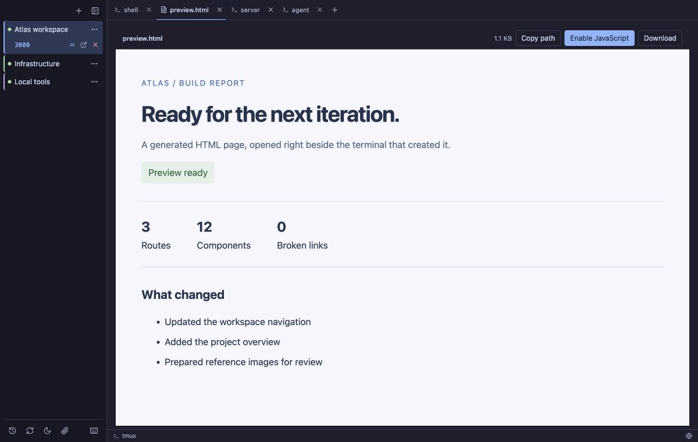
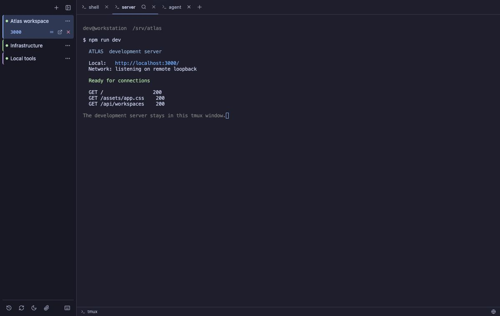
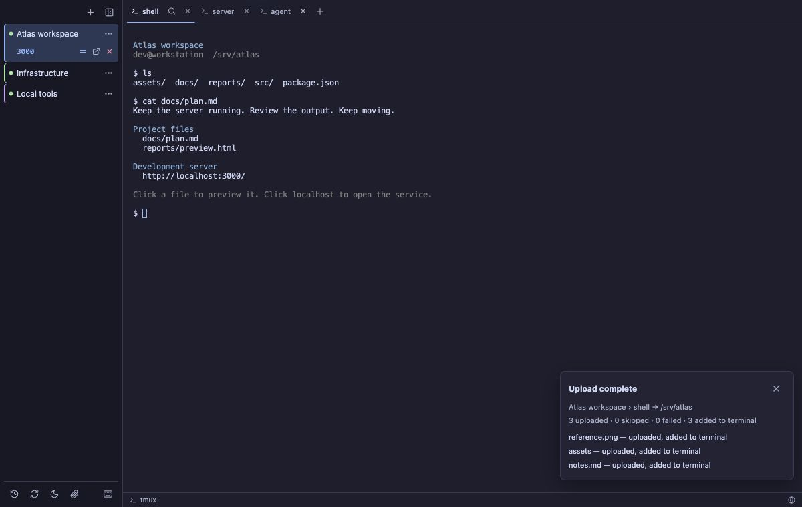

# Buoy — Desktop tmux Client

**Stable tmux connections, with the files and services around them within reach.**

Buoy is a free, open-source desktop client for local and remote tmux workspaces on macOS,
Windows, and Linux. Keep a session running, preview its files in place, open remote localhost
services through automatic SSH tunnels, and drag files from your desktop into the terminal.

[Project website](https://coderlambda.github.io/buoy-tmux/) ·
[Download the latest release](https://github.com/coderlambda/buoy-tmux/releases/latest)

## Five things Buoy helps you do

### 1. Keep a stable connection to tmux

[](docs/screenshots/workspace-overview.png)

The tmux session is the durable workspace; SSH is the connection to it. Change networks,
let the laptop sleep, or quit Buoy, then return to the same running session. Buoy reconnects
with bounded retries and restores the terminal buffer, cursor, and active window. Local
tmux workspaces also survive quitting the app.

The compact sidebar keeps projects in sight, while native tabs map to tmux windows.
Existing panes and tmux key bindings continue to work.

### 2. Preview files and HTML pages in place

[](docs/screenshots/html-preview.png)

Click a file path in terminal output to preview text, Markdown, images, or self-contained
HTML inside Buoy. The preview opens immediately to the right of its source tab, with visible
**Copy path** and **Download** controls. Absolute, home-relative, relative, and common filename
paths are supported, including file links emitted by terminal agents.

HTML files open with JavaScript disabled. **Enable JavaScript** asks for confirmation for
that file. Ordinary web URLs and localhost services open in the system browser.

[See the Markdown preview](docs/screenshots/file-preview.png).

### 3. Recognize localhost service addresses automatically

[](docs/screenshots/localhost-tunnel.png)

Addresses such as `http://localhost:3000`, `localhost:3000`, and `127.0.0.1:8080` become
clickable in terminal output. There is no need to copy the port or assemble a separate
forwarding command each time a development server prints its URL.

### 4. Establish and restore SSH tunnels

Click a remote loopback address and Buoy establishes the SSH forward, checks the service,
and opens its local URL in your browser. The tunnel appears beneath its owning workspace.

Buoy remembers the local port and restores the forward after reconnecting, so an existing
browser tab can keep using the same address. Open it again, request the same local/remote
port with **=**, or stop the forward from the sidebar. Stopping the forward leaves the
remote service running; an occupied local port produces a visible error.

**Recognize the address → establish the tunnel → open the browser.**

### 5. Drag files and folders into the terminal

[](docs/screenshots/file-upload.png)

Drop desktop files or folders onto a connected terminal to upload them into that tab's
current directory over SSH/SCP. Folder structure and empty directories are preserved;
progress, cancellation, and per-item results stay visible. Local tmux tabs copy locally.

- **Upload & attach** adds successful paths to the original terminal input without pressing
  Enter. Supported image paths become attachments in Codex/Claude Code; other items become
  path references. Paths are not inserted if the original terminal program has changed.
- **Upload only** leaves the terminal input alone. Switch modes with the sidebar paperclip.
- Existing names are skipped, including whole folders. Files are not merged into an existing
  folder. Symbolic links and special files are skipped and reported.
- Uploads require a connected tmux-backed terminal. Preview tabs and plain fallback shells
  are not upload targets.

[See the drop target](docs/screenshots/file-drop.png).

Screenshots show the v0.1.4 interface with demonstration workspaces.

## Also included

- **Import existing sessions:** discover local or remote tmux sessions without detaching their
  existing clients or changing shell configuration.
- **Session history:** Detach closes only Buoy's client. End saves a recovery snapshot and
  ends tmux; Restore rebuilds shells in their last directories. It does not restore process
  memory or unsaved application state.
- **Terminal search:** search loaded scrollback per tab with Cmd+F / Ctrl+F, match navigation,
  case sensitivity, and whole-word options.
- **Agent notifications:** per-tab unread indicators for Codex and a Buoy-scoped Claude Code
  hook, without changing global Claude settings.
- **Personalize the workspace:** Dark, Light, or System appearance; project and tab colors;
  rename and reorder projects and tabs with remembered ordering.

## Getting started

### Install

Download the package for your platform from
[GitHub Releases](https://github.com/coderlambda/buoy-tmux/releases/latest):

- **macOS:** universal DMG or app archive for Apple Silicon and Intel. The app is Developer ID
  signed, notarized by Apple, and stapled.
- **Windows:** x64 MSI or setup executable. Windows builds are currently unsigned, so SmartScreen
  may require **More info → Run anyway**.
- **Linux:** x86_64 AppImage, Debian package, or RPM.

### Requirements

For a remote durable session:

- SSH access to the remote machine.
- `tmux` installed on the remote machine.
- tmux 3.2 or newer for native Buoy tabs. Older versions can use the regular terminal view.

For a local durable session, install `tmux` on the local machine. If local tmux is unavailable, Buoy
can still open a plain local shell, but that shell cannot survive quitting the app.

### Open a remote project

1. Select **+ New session**.
2. Choose **Remote host**.
3. Enter an SSH destination such as `user@example.com` or `user@example.com:2222`.
4. Give the project a recognizable title.
5. Leave **Native tabs** enabled to expose tmux windows in Buoy when the host supports it.

Buoy creates and owns an internal tmux session name for the project. You choose the host and title;
there is no tmux session ID to maintain manually.

To use a tmux session that already exists on the host, enter the host and choose **Find existing
tmux sessions**. Select a result and choose **Import**. Buoy attaches to the host's normal tmux
server; other attached tmux clients remain connected. Remote discovery uses a non-interactive SSH
query, so the host must already be reachable through an SSH key, agent, or another authentication
method that does not require a password prompt.

### Open a local project

Choose **Local shell** in the same dialog. Buoy starts your normal shell inside a local tmux session,
giving it the same persistent project and native-tab behavior as a remote workspace.

## Everyday use

- Click a project to open or reconnect it.
- Double-click a project or tab title to rename it.
- Search the active terminal's loaded scrollback with **Cmd+F** on Mac or **Ctrl+F** elsewhere
  (**Ctrl+Shift+F** also works), or click the search icon on the active tab. Use Enter/Shift+Enter
  or F3/Shift+F3 to move between matches, and Escape to close. Queries and case/whole-word options
  are kept separately for each tab; search text is never sent to the shell.
- Drag projects vertically or tabs horizontally to reorder them.
- Use **+** in the tab bar to create a tmux window.
- Click a path in terminal output to preview or download the file.
- Click a remote loopback URL to open it through a managed SSH tunnel.
- Use the sidebar controls to reconnect, detach the client, or deliberately terminate a session.

Closing Buoy does not kill tmux-backed workspaces. They remain on their local or remote tmux server
and are reattached the next time the project is opened.

## Scope and current limitations

- Buoy is centered on tmux-backed projects, not arbitrary terminal profiles or a general command
  launcher.
- Remote transport currently uses SSH. Mosh and Eternal Terminal are not implemented transports.
- Native tabs represent tmux windows; Buoy does not replace tmux's pane and layout management.
- Host-restart recovery is intentionally conservative. It restores one shell per saved window at
  the last known directory and displays the last foreground command as the tab name; it cannot
  restore process memory, unsaved application state, split-pane layouts, or automatically rerun
  commands. Tools such as tmux-resurrect can provide broader tmux-specific restoration separately.
- Windows installers are not yet code-signed.
- Remote file preview intentionally applies size limits and safe rendering rules; it is not a full
  remote file manager.

## Build from source

Buoy uses Tauri v2 with a Rust backend and a strict TypeScript frontend.

```bash
npm ci
npm run tauri:dev
```

Create production bundles with `npm run tauri:build`. Contributors can run the complete validation
suite with `npm run typecheck`, `npm test`, `npm run tauri:test`, and `npm run test:ui`.
The current product screenshot workflow is documented in [docs/product-screenshots.md](docs/product-screenshots.md).

Implementation details and contributor references live in [DESIGN.md](DESIGN.md),
[TEST_PLAN.md](TEST_PLAN.md), [OSC_NOTIFICATIONS_DESIGN.md](OSC_NOTIFICATIONS_DESIGN.md), and
[TAURI_MIGRATION.md](TAURI_MIGRATION.md).

## License

Buoy is available under the [MIT License](LICENSE).
