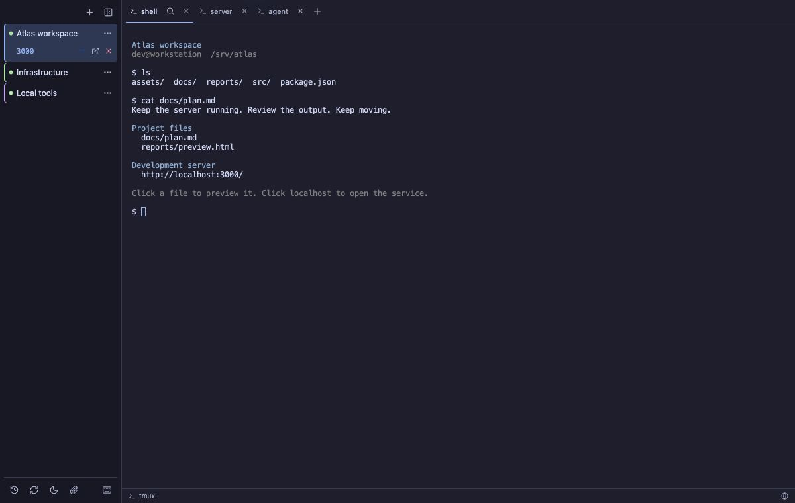

# Buoy

**A focused, resilient desktop client for tmux.**

Buoy gives long-running local and remote tmux sessions a permanent home on your desktop. Open a
project, work across its tmux windows as native tabs, close the app, change networks, or let the
laptop sleep—Buoy reconnects to the same session and brings the workspace back.

Buoy is intentionally not a general-purpose terminal toolbox. It is built around one job: making
tmux sessions easy to find, operate, and trust through unreliable connections.

[Download the latest release](https://github.com/coderlambda/buoy-tmux/releases/latest)

## Why Buoy

A normal SSH terminal treats the connection as the session. When the connection disappears, the
window becomes disposable and getting back to the right tmux session is manual work.

Buoy treats the **tmux session as the durable workspace** and the SSH connection as replaceable:

- Projects remain in a persistent sidebar with their connection state and unread activity.
- Reconnects always target the existing tmux session instead of creating duplicates.
- tmux windows appear as native tabs and stay associated with the correct project.
- Terminal contents, cursor position, and active window are restored after reconnecting.
- Local tmux sessions work the same way and survive quitting Buoy.

The name comes from that behavior: a connection can be pushed under by a wave, but the session
resurfaces.

## Product tour

### Keep every tmux workspace in sight

[](docs/screenshots/workspace-overview.png)

Each sidebar entry is a durable tmux workspace, not a disposable terminal connection. Remote and
local projects live together, while their colored status dots show whether they are connected or
reconnecting. Select a project and its tmux windows become native tabs with independent terminal
buffers and scrollback.

The same view keeps background work visible without becoming noisy: the blue dot under the
connection status rolls up unread activity from the `codex` tab, and the `:3000 → :3000` row shows
an active SSH tunnel for a remote loopback service.

### Import tmux sessions that are already running

[](docs/screenshots/import-existing-sessions.png)

Buoy can inspect the default tmux server on a local or remote host, show each session's window and
attachment counts, and import the one you choose. Sessions already open in Buoy are left out of the
list, and importing does not detach their existing tmux clients. This makes Buoy useful with the
workspaces you already have—there is no migration step or shell setup to maintain.

### Detach safely, or resume deliberately closed work

[](docs/screenshots/session-history.png)

**Detach** closes only Buoy's client and leaves tmux running. **Close** deliberately ends the tmux
session after saving a recovery snapshot in History. Choosing **Resume** rebuilds its tabs as
shells in their last known working directories and labels them with the last foreground commands,
so the context of the workspace is still recognizable after a host restart or intentional close.
It does not pretend to restore process memory or unsaved application state.

## Features

### Durable local and remote workspaces

- Connect to remote machines through SSH and keep the actual workspace alive in tmux.
- Run local shells inside tmux for the same quit-and-return workflow on your own machine.
- Discover sessions already running on the local or remote default tmux server and import them
  without detaching their existing clients or changing their shell configuration.
- Restore saved projects when Buoy opens again.
- Recover from network changes, sleep, and temporary SSH failures with bounded
  retries—without spawning duplicate clients or hammering authentication.
- See clear connecting, connected, reconnecting, disconnected, and failed states in the sidebar.
- If a host reboot removes the tmux server, rebuild the saved windows as shells in their last known
  working directories, labeled with the commands that were running before the reboot.

### tmux windows as native tabs

With tmux 3.2 or newer, Buoy uses tmux control mode to mirror windows directly into its tab bar.

- Create, select, close, and rename tmux windows from the app.
- Reorder projects and tabs with drag and drop; the order is remembered.
- Rename projects independently from their tmux session names.
- Keep each tab's output, scrollback, cursor, and notification state separate.
- Fall back to a regular single terminal view when native tabs are unavailable or disabled.

Buoy maps tmux **windows** to tabs. Layouts and panes inside a window remain under tmux's control,
so existing tmux workflows and key bindings continue to work.

### Reconnection that preserves what you were looking at

Reconnection is more than starting SSH again. Buoy waits for tmux and the terminal view to agree on
the visible size, then restores the active window, complete buffer, and cursor before normal input
resumes. Hidden tabs are refreshed when revealed, and the visible pane recovers after focus changes
or system wake.

The result is designed to feel like returning to the same terminal, not opening a replacement one.

### Agent notifications without global configuration

Buoy shows an unread dot on the tab that requested attention and rolls it up to the project in the
sidebar.

- Codex works through its terminal notification fallback with no additional Buoy configuration.
- Claude Code receives a Buoy-scoped hook integration without modifying global Claude settings.
- Detached and background tabs retain their own unread state.
- Interacting with the relevant terminal acknowledges that tab without clearing unrelated work.
- Existing cmux-managed Claude installations are detected so Claude is not wrapped twice.

### Terminal output that is useful outside the terminal

- Click web URLs to open them in the default browser.
- Click absolute, home-relative, relative, and common filename paths to preview remote files inside
  Buoy.
- Preview text, Markdown, images, and self-contained HTML; download the original file locally when
  needed.
- Open remote `localhost:<port>` links through an on-demand SSH tunnel. Buoy remembers the local
  port and restores the tunnel after reconnecting, so an already-open browser tab keeps working.
- Use the same smart URL and file handling for OSC 8 hyperlinks emitted by modern command-line
  tools.

### A dependable terminal experience

- Responsive terminal rendering with automatic fallback and full-screen repaint recovery.
- One consistent terminal scrollbar with persistent scrollback for each tab.
- Remote clipboard copy support plus normal selection shortcuts and context-menu copy.
- Correct input and terminal replies even when switching quickly between tmux windows.
- Session and tab colors, inline rename, persistent ordering, and a focused connection-status UI.
- Dark blue by default. Click the appearance icon in the sidebar footer to choose Dark, Light, or
  System; Buoy remembers the choice and updates the window and terminals together.

## Getting started

### Install

Download the package for your platform from
[GitHub Releases](https://github.com/coderlambda/buoy-tmux/releases/latest):

- **macOS:** universal DMG or app archive for Apple Silicon and Intel. The app is Developer ID
  signed, notarized by Apple, and stapled.
- **Windows:** x64 MSI or setup executable. Windows builds are currently unsigned, so SmartScreen
  may require **More info → Run anyway**.
- **Linux:** x86_64 AppImage, Debian package, or RPM.

### Requirements

For a remote durable session:

- SSH access to the remote machine.
- `tmux` installed on the remote machine.
- tmux 3.2 or newer for native Buoy tabs. Older versions can use the regular terminal view.

For a local durable session, install `tmux` on the local machine. If local tmux is unavailable, Buoy
can still open a plain local shell, but that shell cannot survive quitting the app.

### Open a remote project

1. Select **+ New session**.
2. Choose **Remote host**.
3. Enter an SSH destination such as `user@example.com` or `user@example.com:2222`.
4. Give the project a recognizable title.
5. Leave **Native tabs** enabled to expose tmux windows in Buoy when the host supports it.

Buoy creates and owns an internal tmux session name for the project. You choose the host and title;
there is no tmux session ID to maintain manually.

To use a tmux session that already exists on the host, enter the host and choose **Find existing
tmux sessions**. Select a result and choose **Import**. Buoy attaches to the host's normal tmux
server; other attached tmux clients remain connected. Remote discovery uses a non-interactive SSH
query, so the host must already be reachable through an SSH key, agent, or another authentication
method that does not require a password prompt.

### Open a local project

Choose **Local shell** in the same dialog. Buoy starts your normal shell inside a local tmux session,
giving it the same persistent project and native-tab behavior as a remote workspace.

## Everyday use

- Click a project to open or reconnect it.
- Double-click a project or tab title to rename it.
- Drag projects vertically or tabs horizontally to reorder them.
- Use **+** in the tab bar to create a tmux window.
- Click a path in terminal output to preview or download the file.
- Click a remote loopback URL to open it through a managed SSH tunnel.
- Use the sidebar controls to reconnect, detach the client, or deliberately terminate a session.

Closing Buoy does not kill tmux-backed workspaces. They remain on their local or remote tmux server
and are reattached the next time the project is opened.

## Scope and current limitations

- Buoy is centered on tmux-backed projects, not arbitrary terminal profiles or a general command
  launcher.
- Remote transport currently uses SSH. Mosh and Eternal Terminal are not implemented transports.
- Native tabs represent tmux windows; Buoy does not replace tmux's pane and layout management.
- Host-restart recovery is intentionally conservative. It restores one shell per saved window at
  the last known directory and displays the last foreground command as the tab name; it cannot
  restore process memory, unsaved application state, split-pane layouts, or automatically rerun
  commands. Tools such as tmux-resurrect can provide broader tmux-specific restoration separately.
- Windows installers are not yet code-signed.
- Remote file preview intentionally applies size limits and safe rendering rules; it is not a full
  remote file manager.

## Build from source

Buoy uses Tauri v2 with a Rust backend and a strict TypeScript frontend.

```bash
npm ci
npm run tauri:dev
```

Create production bundles with `npm run tauri:build`. Contributors can run the complete validation
suite with `npm run typecheck`, `npm test`, `npm run tauri:test`, and `npm run test:ui`.
Regenerate the privacy-safe product screenshots with `npm run screenshots:readme`.

Implementation details and contributor references live in [DESIGN.md](DESIGN.md),
[TEST_PLAN.md](TEST_PLAN.md), [OSC_NOTIFICATIONS_DESIGN.md](OSC_NOTIFICATIONS_DESIGN.md), and
[TAURI_MIGRATION.md](TAURI_MIGRATION.md).

## License

Buoy is available under the [MIT License](LICENSE).
